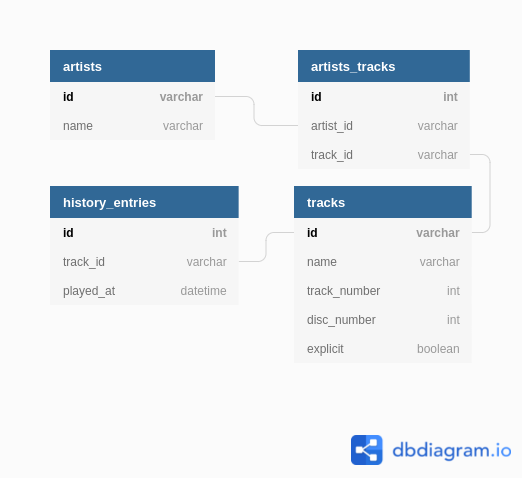

# Spotify History Playback Saver
This service is used to save your Spotify history every 45 minutes. The fetched songs are saved in a MySQL database.
It uses OAuth to log into Spotify.

## Setup
#### You will need gvm (go version manager)

1. Create a Spotify application at: https://developer.spotify.com/dashboard/applications
2. Run `bin/activate` and build with `go build`
3. Create `.env` file out of `.env.example` and add client credentials
    + Don't forget to create database and load schema with `./SpotifyPlaybackSaver -create_db` and `./SpotifyPlaybackSaver -migrate`
    + Also add db credentials to `.env` file
4. Generate OAuth token with `./SpotifyPlaybackSaver -login`
    + That will generate a `token.json` file with credentials
5. Start `./SpotifyPlaybackSaver` and enjoy!

### Database schema
https://dbdiagram.io/d/6055e6a2ecb54e10c33c63ac

### Many thanks to these libraries that made my life easier:
+ https://github.com/zmb3/spotify
+ https://github.com/gobuffalo
+ https://github.com/antonfisher/nested-logrus-formatter
+ https://github.com/sirupsen/logrus
